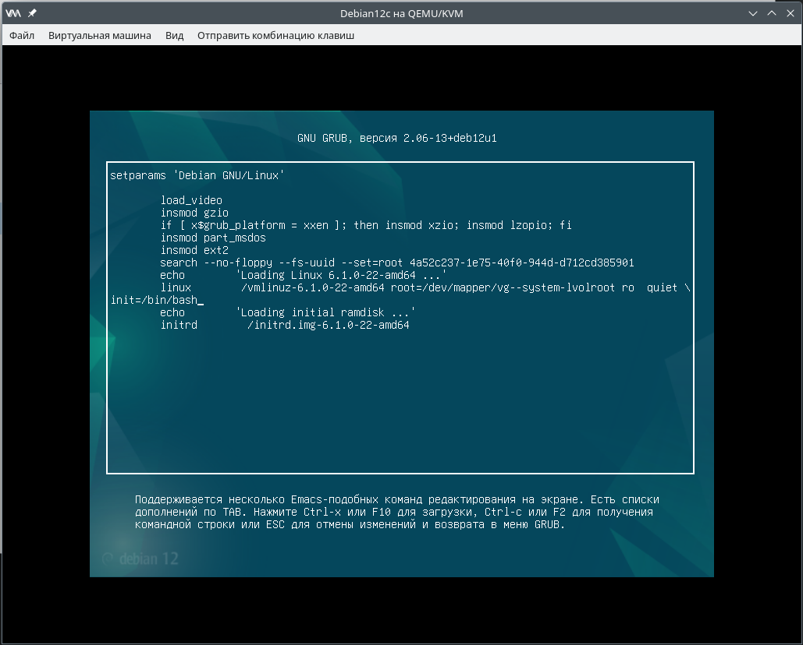
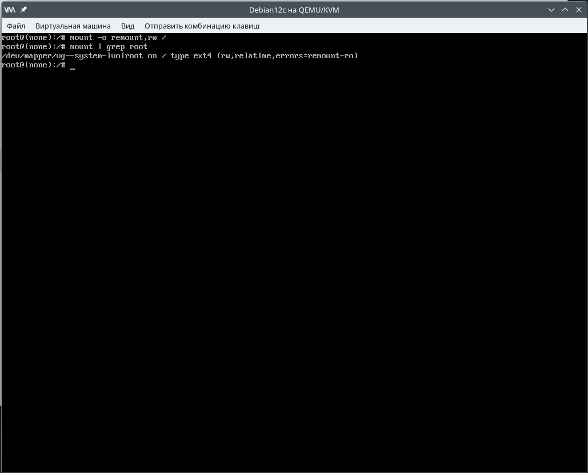
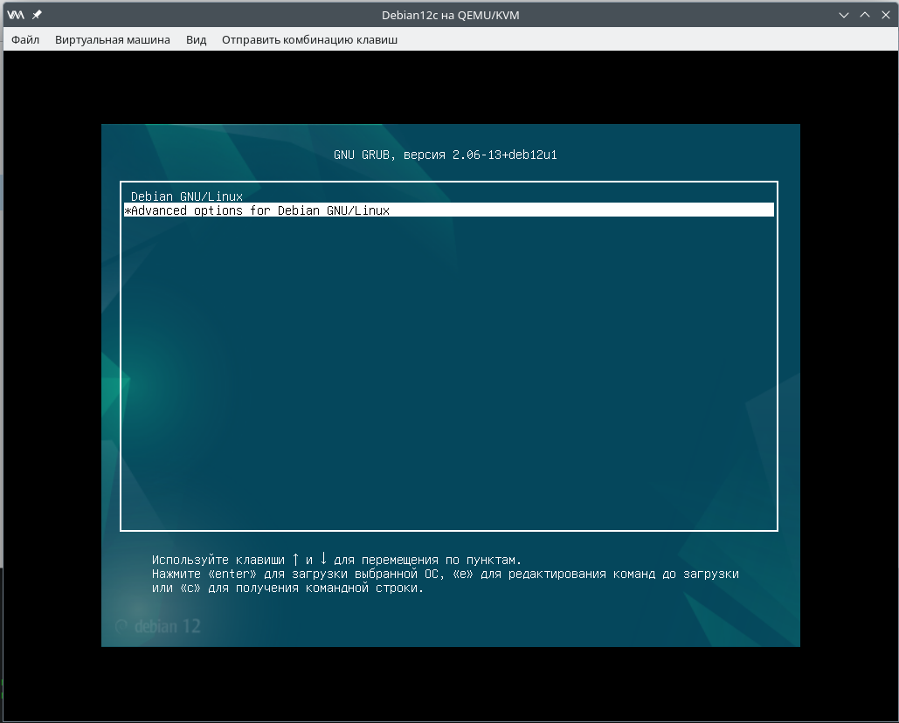
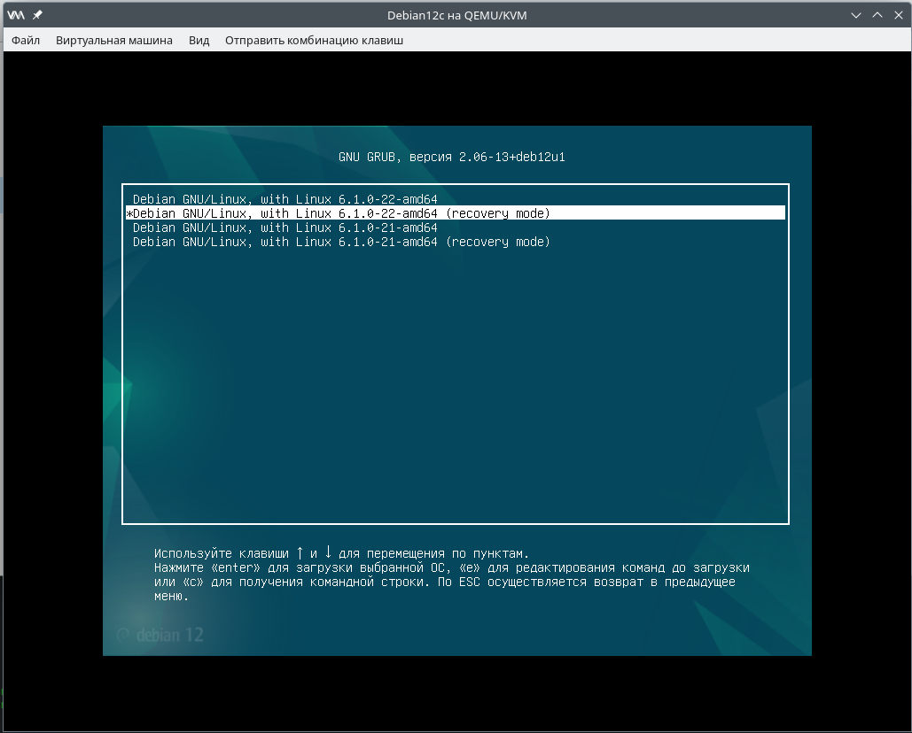
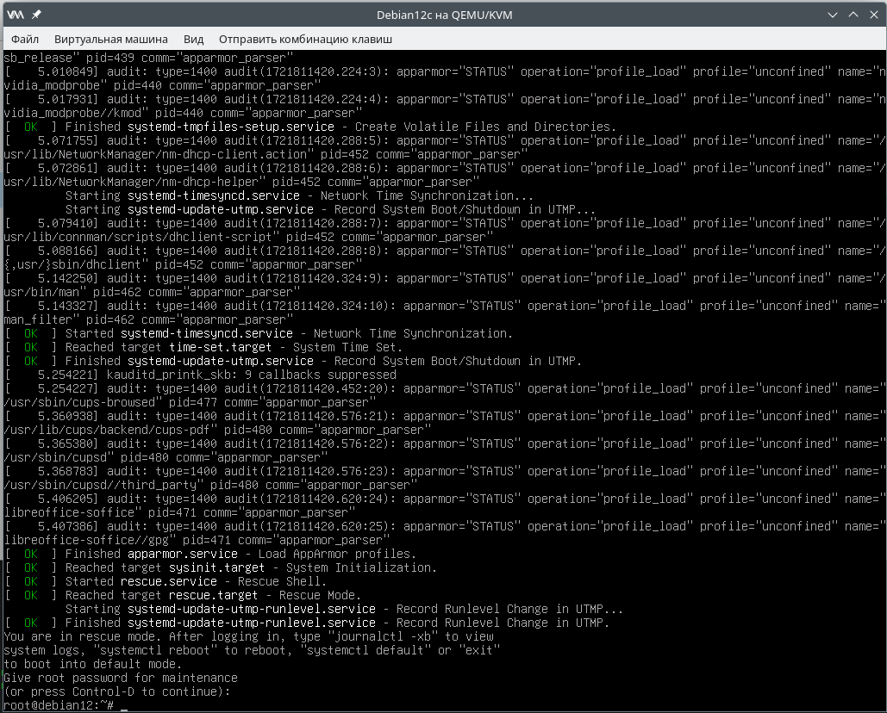
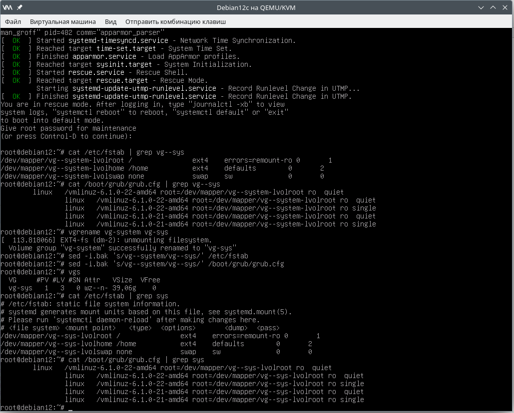
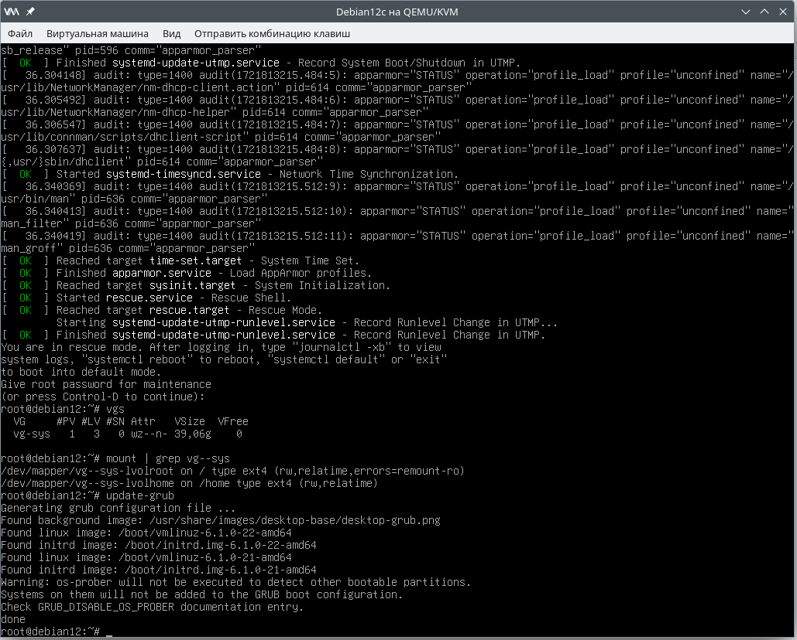

### Загрузка системы. Настройка GRUB2
[GRUB](https://www.gnu.org/software/grub/) (GRand Unified Bootloader) — мультисистемный модульный программируемый кроссплатформенный загрузчик с поддержкой сети, множества файловых систем, таблиц разделов, логических томов, образов и архивов.
Текущая версия GRUB — GRUB 2 — не использует код старой ветки GRUB 0.9x (GRUB Legacy) и создана на основе проекта [PUPA](https://www.nongnu.org/pupa/). 

[Источник](https://wiki.archlinux.org/title/GRUB_(%D0%A0%D1%83%D1%81%D1%81%D0%BA%D0%B8%D0%B9))
Цель работы:
  - Научиться попадать в систему в **Recovery mode** без пароля (в некоторых случаях);
  - Устанавливать систему с LVM, переименовывать VG, обновлять конфигурацию для последующей загрузки.

#### Подготовка окружения
В нашем примере используется гипервизор Qemu-KVM, библиотека Libvirt. В качестве хостовой системы - OpenSuse Leap 15.5. Автоматическое разворачивание стенда осуществляется с помощью Vagrant.

Для работы Vagrant с Libvirt установлен пакет vagrant-libvirt:
```
Сведения — пакет vagrant-libvirt:
---------------------------------
Репозиторий            : Основной репозиторий
Имя                    : vagrant-libvirt
Версия                 : 0.10.2-bp155.1.19
Архитектура            : x86_64
Поставщик              : openSUSE
Размер после установки : 658,3 KiB
Установлено            : Да
Состояние              : актуален
Пакет с исходным кодом : vagrant-libvirt-0.10.2-bp155.1.19.src
Адрес источника        : https://github.com/vagrant-libvirt/vagrant-libvirt
Заключение             : Провайдер Vagrant для libvirt
Описание               : 

    This is a Vagrant plugin that adds a Libvirt provider to Vagrant, allowing
    Vagrant to control and provision machines via the Libvirt toolkit.
```
Пакет Vagrant также устанавливаем из репозиториев. Текущая версия для OpenSuse Leap 15.5:
```
max@localhost:~/vagrant/vg3> vagrant -v
Vagrant 2.2.18
```
Образ операционной системы создан заранее, для этого установлен [Debian Linux из официального образа netinst](https://www.debian.org/distrib/netinst)

#### Vagrantfile
Все основные параметры виртуальных машин задаются в блоке ***vm.provider***. Настройки ВМ выглядят таким образом:
```
Vagrant.configure("2") do |config|
  config.vm.define "Debian12" do |srv|
    srv.vm.box = "/home/max/vagrant/images/debian12"
    srv.vm.provider "libvirt" do |lv|
      lv.memory = "2048"
      lv.cpus = "2"
      lv.title = "Debian12"
      lv.description = "Виртуальная машина на базе дистрибутива Debian Linux"
      lv.management_network_name = "vagrant-libvirt-mgmt"
      lv.management_network_address = "192.168.121.0/24"
      lv.management_network_keep = "true"
      lv.management_network_mac = "52:54:00:27:28:83"
      lv.storage :file, :size => '1G', :device => 'vdb', :allow_existing => false
    end
```
Здесь заданы:
  - кол-во процессоров,
  - размер оперативной памяти,
  - настройки сетевого интерфейса,
  - дополнительгые дисковые устройства.

#### Загрузка в режиме восстановления (Recovery mode)
##### Первый способ
В меню GRUB нажимаем клавишу ***e***, после чего попадаем в окно редактирования. Дописываем в конец строки, начинающейся с ***Linux***, ***init=/bin/bash*** и жмём сочетание клавиш <ctrl+x>.

После загрузки системы смонтируем корневую файловую систему в режиме записи с помощью команды:
```
mount -o remount,rw /
```


##### Второй способ
Выбираем в меню GRUB "Advanced options for Debian GNU/Linux"


После этого, во вложенном меню, выбираем пункт "Debian GNU/Linux ... (recovery mode)"

В данном случае, после загрузки системы, для доступа в консоль придётся ввести пароль для пользователя **root**.


#### Изменения параметров блочных устройств и последующая загрузка операционной системы на примере с Volume Group, на которой размещена корневая файловая система
Переименуем группу томов, на которой находятся файловые системы ***/*** и ***/home***, после чего обновим настройки для последующей успешной загрузки системы. 
Для этого нам понадобится выяснить, как прописаны соответствующие блочные устройства в двух файлах - ***/etc/fstab*** и ***/boot/grub/grub.cfg***.
```
cat /etc/fstab | grep "vg-sys"
cat /boot/grub/grub.cfg" | grep "vg-sys"
vgrename vg-system vg-sys
```
После этого обновим настройки в этих файлах:
```
sed -i.bak 's/vg--system/vg--sys/' /etc/fstab
sed -i.bak 's/vg--system/vg--sys/' /boot/grub/grub.cfg
```


Перезагружаемся и проверяем, что все файловые системы успешно смонтированы:
```
mount | grep "vg--sys"
```


Спасибо за прочтение! :potted_plant:
